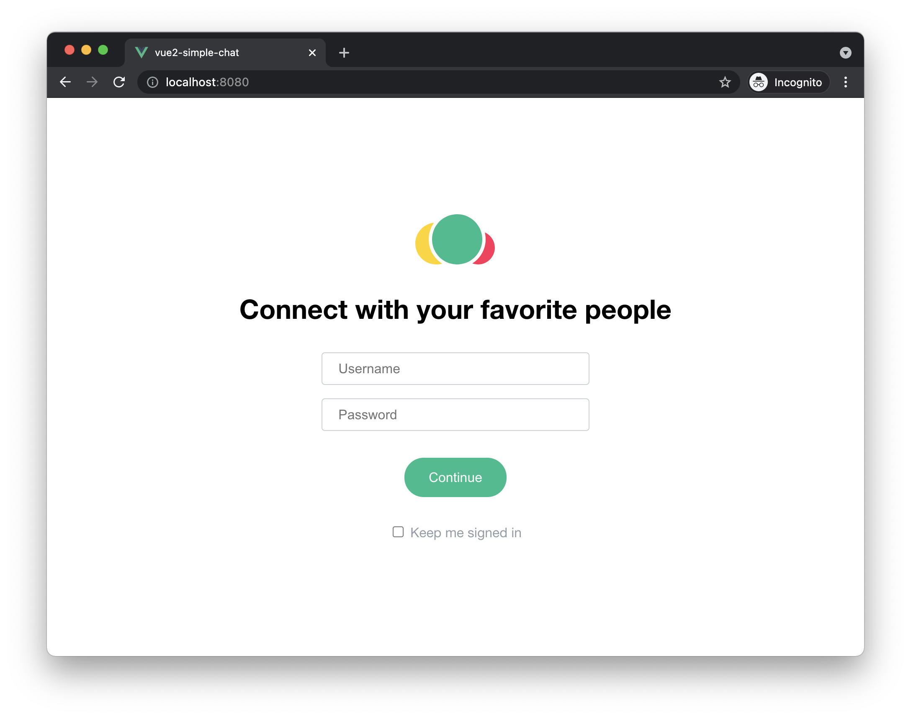
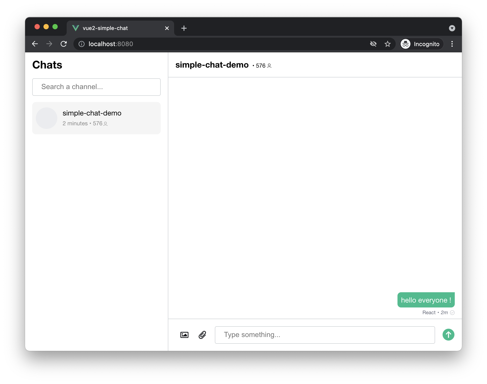

# VueJS simple chat

[Try me on codesandbox!](https://codesandbox.io/s/github/AmityCo/Amity-Social-Cloud-Web-Sample-Apps/tree/main/messaging-app-with-Vue2)

## Stack used

- [VueJS (v2)](https://vuejs.org/)

## Scope of demo

From a simple `vue create XXX` boilerplate, we've added the minimal amount of code to create a simple chat app.

You will be able to see the typical use of live objects and live collections working with react hooks, and the typical implementation for a chat app.

## Getting started

1. clone the repo
2. `yarn`
3. `yarn serve`

## Screenshots

